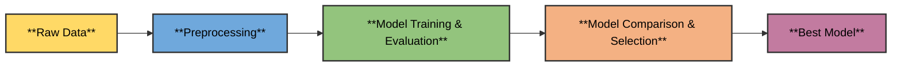

# Assignment_Classification_ML_Models
---
# 1. HR Employee Attrition Prediction

## Project Overview
This project predicts employee attrition using a machine learning pipeline. It follows a systematic workflow to prepare data, train models, evaluate performance, and select the best-performing model.

**Workflow:**

## Architectural Overview

---

## Data Preprocessing

The following steps are performed to prepare the data:

1. **Dropping Columns**  
   Columns `EmployeeCount`, `StandardHours`, `Over18`, and `EmployeeNumber` are removed as they are constants or unique identifiers with no predictive value.

2. **Target Encoding**  
   The target variable `Attrition` is converted from categorical (`Yes`, `No`) to numerical (`1`, `0`).

3. **Feature Engineering**  
   - **One-Hot Encoding:** Categorical features like `BusinessTravel`, `Department`, `EducationField`, `Gender`, `JobRole`, `MaritalStatus`, and `OverTime` are converted to numerical format using one-hot encoding.  
   - **Feature Scaling:** Numerical features are scaled using `StandardScaler` to standardize the data (mean = 0, standard deviation = 1).

---

## Model Building and Evaluation

The following classifiers are used:

| Classifier       | Description |
|-----------------|-------------|
| **Decision Tree** | A non-parametric supervised learning algorithm that uses a tree-like model of decisions and their possible consequences. |
| **Random Forest** | An ensemble method that constructs multiple decision trees and outputs the mode of the classes. |
| **AdaBoost**      | A boosting algorithm that combines multiple "weak" learners into a single "strong" learner. It iteratively corrects errors from previous learners. |
| **XGBoost**       | An optimized distributed gradient boosting library designed to be efficient, flexible, and portable. |
| **CatBoost**      | A high-performance gradient boosting library that handles categorical features automatically. |

---

## Model Training & Evaluation

Each model is trained on the preprocessed training data (`X_train`, `y_train`) and evaluated on test data (`X_test`, `y_test`). The following metrics are used for performance evaluation:

- Accuracy
- Precision
- Recall
- F1-score

---

