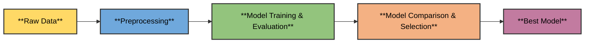

# Assignment_Classification_ML_Models
---
# 1. HR Employee Attrition Prediction

## 🔹 Project Overview
This project predicts employee attrition using a machine learning pipeline. It follows a systematic workflow to prepare data, train models, evaluate performance, and select the best-performing model.

**Workflow:**

## Architectural Overview

---

## 📁 Data Preprocessing

The following steps are performed to prepare the data:

1. **Dropping Columns**  
   Columns `EmployeeCount`, `StandardHours`, `Over18`, and `EmployeeNumber` are removed as they are constants or unique identifiers with no predictive value.

2. **Target Encoding**  
   The target variable `Attrition` is converted from categorical (`Yes`, `No`) to numerical (`1`, `0`).

3. **Feature Engineering**  
   - **One-Hot Encoding:** Categorical features like `BusinessTravel`, `Department`, `EducationField`, `Gender`, `JobRole`, `MaritalStatus`, and `OverTime` are converted to numerical format using one-hot encoding.  
   - **Feature Scaling:** Numerical features are scaled using `StandardScaler` to standardize the data (mean = 0, standard deviation = 1).

---

## Model Building and Evaluation

The following classifiers are used:

| Classifier       | Description |
|-----------------|-------------|
| **Decision Tree** | A non-parametric supervised learning algorithm that uses a tree-like model of decisions and their possible consequences. |
| **Random Forest** | An ensemble method that constructs multiple decision trees and outputs the mode of the classes. |
| **AdaBoost**      | A boosting algorithm that combines multiple "weak" learners into a single "strong" learner. It iteratively corrects errors from previous learners. |
| **XGBoost**       | An optimized distributed gradient boosting library designed to be efficient, flexible, and portable. |
| **CatBoost**      | A high-performance gradient boosting library that handles categorical features automatically. |

---

## Model Training & Evaluation

Each model is trained on the preprocessed training data (`X_train`, `y_train`) and evaluated on test data (`X_test`, `y_test`). The following metrics are used for performance evaluation:

- Accuracy
- Precision
- Recall
- F1-score

---

# 2. 📊 Telco Customer Churn Prediction

## Project Overview
This project focuses on building and evaluating machine learning models to predict customer churn for a fictional telecommunications company. The goal is to identify customers likely to leave based on their demographic and service data.

---

## 📁 Dataset Overview
The dataset (`WA_Fn-UseC_-Telco-Customer-Churn.csv`) contains information on 7,043 customers, including:

**Demographics:** gender, senior citizen status, partner, dependents  
**Services:** phone service, multiple lines, internet service, online security, online backup, device protection, tech support, streaming TV, streaming movies  
**Account Information:** tenure, contract type, paperless billing, payment method, monthly charges, total charges  
**Target Variable:** `Churn` (indicates whether the customer left the company)

---

## Architectural Flow

```mermaid
flowchart LR
    A[**Data Ingestion**] --> B[**Data Preprocessing**]
    B --> C[**Feature & Target Split**]
    C --> D[**Data Splitting**]
    D --> E[**Model Training & Evaluation**]
    E --> F[**Model Comparison**]
    F --> G[**Best Model Selection**]

    style A fill:#FFD966,stroke:#333,stroke-width:2px,color:#000
    style B fill:#6FA8DC,stroke:#333,stroke-width:2px,color:#000
    style C fill:#93C47D,stroke:#333,stroke-width:2px,color:#000
    style D fill:#F4B183,stroke:#333,stroke-width:2px,color:#000
    style E fill:#C27BA0,stroke:#333,stroke-width:2px,color:#000
    style F fill:#9E9E9E,stroke:#333,stroke-width:2px,color:#000
    style G fill:#76A5AF,stroke:#333,stroke-width:2px,color:#000
```

---

## ⚙️ Pipeline Steps

### 2. Data Preprocessing
- Convert `TotalCharges` from string to numeric and handle missing values with imputation.
- Encode categorical variables using One-Hot Encoding and Label Encoding.

### 3. Feature & Target Split
- **Features (X):** Independent variables for prediction
- **Target (y):** `Churn` column to be predicted

### 4. Data Splitting
Partition data into training and testing sets (typically 80% training, 20% testing).

### 5. Model Training & Evaluation
**Trained Models:**
- Decision Tree Classifier: Tree-based decision model
- Random Forest Classifier: Ensemble of decision trees for robust predictions
- AdaBoost Classifier: Combines weak learners to form a strong learner
- XGBoost Classifier: Efficient gradient boosting framework
- CatBoost Classifier: Handles categorical features automatically

**Evaluation Metrics:** Accuracy, F1-Score

### 6. Model Comparison
Compare models based on performance metrics to identify the best-performing model.

---

